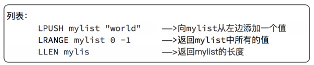
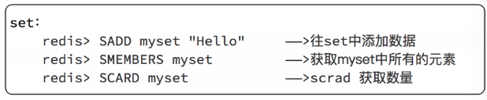
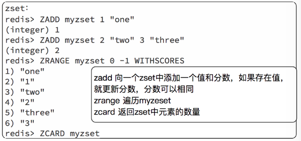
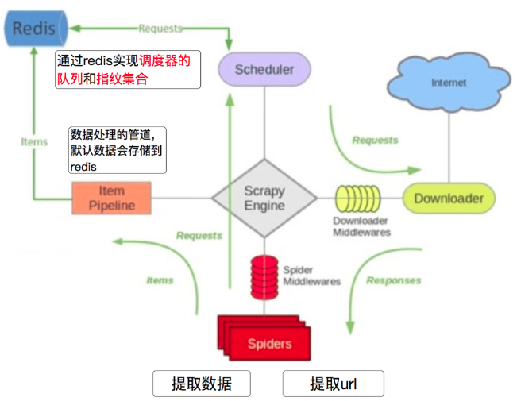
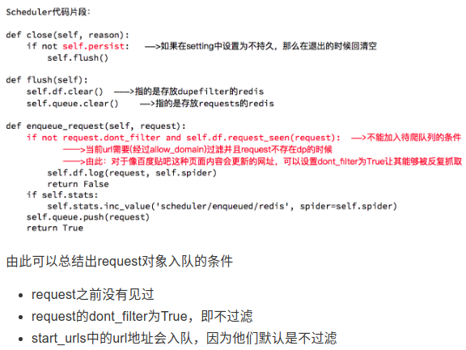
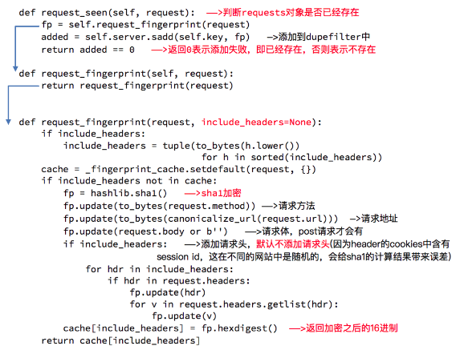

### scrapy_redis 实现增量式爬虫
Scrapy_redis ： Redis-based components for Scrapy.

Github地址：https://github.com/rmax/scrapy-redis
scrapy_redis 是在scrapy 基础上添加`redis`功能，应用于大型分布式爬虫

#### scrapy_redis功能体现
- 请求的持久化
- 去重的持久化
- 实现分布式

#### redis中常见的命令
1. select index  切换库名
2. keys *  查看所有的键
3. type  查看键的类型
4. flushdb  清空db
5. flushall  清空数据库

常用的数据类型
**列表**

查询数据个数： llen

**集合**

查询数据个数： scard

**有序集合**

查询数据个数： zcard

#### scrapy_redis中的对象和指纹
- 在scrapy_redis中，所有的待抓取的对象和去重的指纹都存在所有的服务器公用的redis中(**scrapy_redis使用redis来进行存储*未抓取请求*和*请求指纹***)
- 所有的服务器公用一个redis中的request对象
- 所有的request对象在存入redis前，都会在同一个redis中进行判断，之前是否存入过
- 在默认情况下所有的数据都会保存在redis中


#### Scrapy_redis中在setting中增加了几行：

```Python
# 指定了去重的类
DUPEFILTER_CLASS = "scrapy_redis.dupefilter.RFPDupeFilter"
# 指定了调度器的类
SCHEDULER = "scrapy_redis.scheduler.Scheduler"
# 调度器的内容是否持久化
SCHEDULER_PERSIST = True

ITEM_PIPELINES = {
    'example.pipelines.ExamplePipeline': 300,
    'scrapy_redis.pipelines.RedisPipeline': 400,
}

REDIS_URL = "redis://127.0.0.1:6379"
```

- 替换部分
 1. 替换了scrapy的调度器部分，使用了scrapy_redis中自己实现的调度器类，该调度器会从redis中存储和提取Request请求对象
 2. 替换了scrapy的Request去重部分，使用了scrapy_redis中自己实现的去重类，该去重类将Request的指纹存在redis的set集合中实现去重
- 优点
  分布式爬虫可以实现大型爬虫需求。可以通过加机器的形式 扩展爬虫的性能，实现持久化功能
- 缺点
不适合小型爬虫

#### scrapy 实现生成指纹

```Python
fp = hashlib.sha1()
        fp.update(to_bytes(request.method))
        fp.update(to_bytes(canonicalize_url(request.url)))
        fp.update(request.body or b'')
        if include_headers:
            for hdr in include_headers:
                if hdr in request.headers:
                    fp.update(hdr)
                    for v in request.headers.getlist(hdr):
                        fp.update(v)
```

### scrapy
***
##### scheduler 调度器
- 入队条件
dist-packages\scrapy\core\scheduler.py 19行
```Python
def enqueue_request(self, request):
	# 条件成立 就进行去重
    if not request.dont_filter and self.df.request_seen(request):
    # 只有不过滤且看到过才不会入队(not request.dont_filter)+self.df.request_seen(request)
        self.df.log(request, self.spider)
        return False
    # 上边条件不成立 就入队
    dqok = self._dqpush(request)
    if dqok:
        self.stats.inc_value('scheduler/enqueued/disk', spider=self.spider)
    else:
        self._mqpush(request)
        self.stats.inc_value('scheduler/enqueued/memory', spider=self.spider)
    self.stats.inc_value('scheduler/enqueued', spider=self.spider)
    return True

```

##### RFPDupeFilter 去重
- request_seen 请求是否看过  dist-packages\scrapy\dupefilters.py 47行

```Python
def request_seen(self, request):
	  # 计算指纹
    fp = self.request_fingerprint(request)
   	# 判断指纹在不在 set集合中
    if fp in self.fingerprints:
    	  # 如果在返回True 说明之前看过
        return True
    # 如果没有看过 就添加指纹
    self.fingerprints.add(fp)
    if self.file:
        self.file.write(fp + os.linesep) # os.linesep表示当前平台使用的行终止符

```
##### request_fingerprint 生成指纹
- request_fingerprint生成指纹  dist-packages\scrapy\utils\request.py 19行
-
```Python
def request_fingerprint(request, include_headers=None):
    if include_headers:
        include_headers = tuple(to_bytes(h.lower())
                                 for h in sorted(include_headers))
    cache = _fingerprint_cache.setdefault(request, {})
    if include_headers not in cache:
    	# 创建一个sha1对象
        fp = hashlib.sha1()
        # 添加请求方法 Post还是Get
        fp.update(to_bytes(request.method))
        # 添加url地址
        fp.update(to_bytes(canonicalize_url(request.url)))
        # 添加请求体body
        fp.update(request.body or b'')
        if include_headers:
            for hdr in include_headers:
                if hdr in request.headers:
                    fp.update(hdr)
                    for v in request.headers.getlist(hdr):
                        fp.update(v)
        # 计算指纹
        cache[include_headers] = fp.hexdigest()
    # 返回指纹
    return cache[include_headers]
```


### scrapy_redis
***
#### Scrapy_redis之RddisPipeline
scrapy_redis调度器的实现了决定什么时候把request对象加入带抓取的队列，同时把请求过的request对象过滤掉
- enqueue_request入队条件  dist-packages\scrapy_redis\scheduler.py 161行

```Python
def enqueue_request(self, request):
	# 条件成立 就去重
    if not request.dont_filter and self.df.request_seen(request):
    	# 打印日志
        self.df.log(request, self.spider)
        return False
    if self.stats:
        self.stats.inc_value('scheduler/enqueued/redis', spider=self.spider)
    # 添加不成立就入队
    self.queue.push(request)
    return True
```

##### Scrapy_redis之RddisPipeline
request_seen 请求是否看过  dist-packages\scrapy_redis\dupefilter.py 86行
```Python
def request_seen(self, request):
	# 计算指纹
    fp = self.request_fingerprint(request)
    # This returns the number of values added, zero if already exists.
    # 将指纹添加到redis set中
    # 如果添加数量为0 说明之前添加过 这次没有添加进去
    # 如果添加数量为1 说明之前没有添加过 这次添加进入了
    added = self.server.sadd(self.key, fp)
    # 如果added等于0 说明之前添加过 这次没有添加进去 也就是之前看过
    return added == 0
```

##### Scrapy_redis之RFPDupeFilter
RFPDupeFilter 实现了对request对象的加密
```python
def request_seen(self, request):
	# 计算指纹
    fp = self.request_fingerprint(request)
    # This returns the number of values added, zero if already exists.
    # 将指纹添加到redis set中
    # 如果添加数量为0 说明之前添加过 这次没有添加进去
    # 如果添加数量为1 说明之前没有添加过 这次添加进入了
    added = self.server.sadd(self.key, fp)
    # 如果added等于0 说明之前添加过 这次没有添加进去 也就是之前看过
    return added == 0
```


